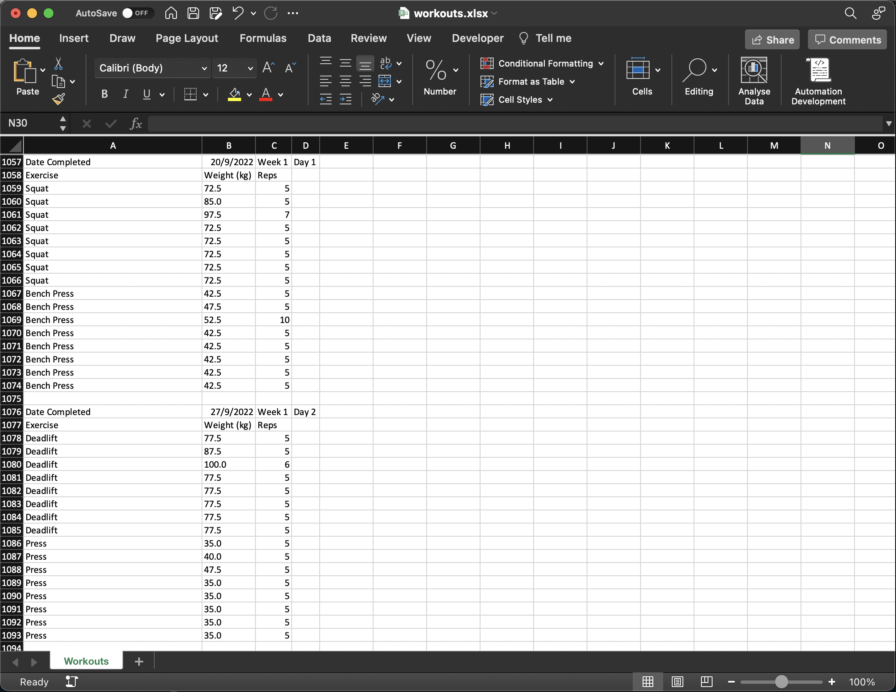

# keylifts-data-wrangler

This is a simple tool to help you export your workout data from the
[KeyLifts](https://keylifts.com/) app as its data export functionality is not
very useful and only seems to export Training Maxes and Personal Records, not
the actual workout data.

## How to use

Currently no build is available, so you need to clone the repo and run it as a
script locally.

- Get the `watermelon.db` file from the app, for iOS this can be found in the
`ultimate531` folder in the `Files` app.
- Copy the `watermelon.db` file to the root of the repo and run
the script.
- `workouts.xlsx` will be created in the root of the repo.

## Dev notes

The watermelondb database used by the Keylifts app does not have any of its
columns types defined. There are more tables and more columns than exported in
the excel file.
